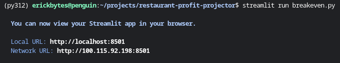
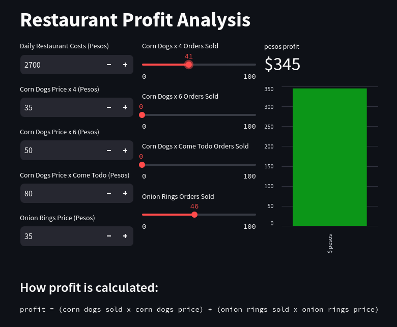

# restaurant-profit-projector
A streamlit dashboard for projecting breakeven profit scenarios

**Install Streamlit**
```
pip install streamlit
```

Run the dashboard with this command:
```
streamlit run breakeven.py
```




